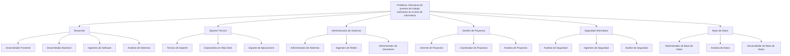
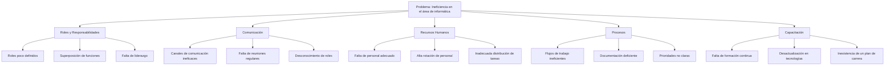

# diagrama de ishikawa AF4

```mermaid
graph TD
    A[Problema: Estructura de puestos de trabajo ineficiente en el área de informática] --> B[Desarrollo]
    A --> C[Soporte Técnico]
    A --> D[Administración de Sistemas]
    A --> E[Gestión de Proyectos]
    A --> F[Seguridad Informática]
    A --> G[Base de Datos]

    B --> B1[Desarrollador Frontend]
    B --> B2[Desarrollador Backend]
    B --> B3[Ingeniero de Software]
    B --> B4[Analista de Sistemas]

    C --> C1[Técnico de Soporte]
    C --> C2[Especialista en Help Desk]
    C --> C3[Soporte de Aplicaciones]

    D --> D1[Administrador de Sistemas]
    D --> D2[Ingeniero de Redes]
    D --> D3[Administrador de Servidores]

    E --> E1[Gerente de Proyectos]
    E --> E2[Coordinador de Proyectos]
    E --> E3[Analista de Proyectos]

    F --> F1[Analista de Seguridad]
    F --> F2[Ingeniero de Seguridad]
    F --> F3[Auditor de Seguridad]

    G --> G1[Administrador de Base de Datos]
    G --> G2[Analista de Datos]
    G --> G3[Desarrollador de Base de Datos]
```

```mermaid
graph TD
    A[Problema: Ineficiencia en el área de informática] --> B[Roles y Responsabilidades]
    A --> C[Comunicación]
    A --> D[Recursos Humanos]
    A --> E[Procesos]
    A --> F[Capacitación]

    B --> B1[Roles poco definidos]
    B --> B2[Superposición de funciones]
    B --> B3[Falta de liderazgo]

    C --> C1[Canales de comunicación ineficaces]
    C --> C2[Falta de reuniones regulares]
    C --> C3[Desconocimiento de roles]

    D --> D1[Falta de personal adecuado]
    D --> D2[Alta rotación de personal]
    D --> D3[Inadecuada distribución de tareas]

    E --> E1[Flujos de trabajo ineficientes]
    E --> E2[Documentación deficiente]
    E --> E3[Prioridades no claras]

    F --> F1[Falta de formación continua]
    F --> F2[Desactualización en tecnologías]
    F --> F3[Inexistencia de un plan de carrera]
```
